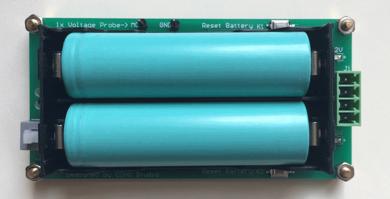
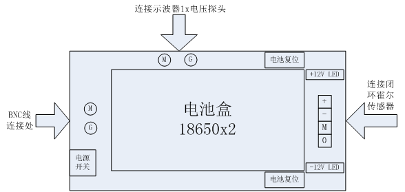
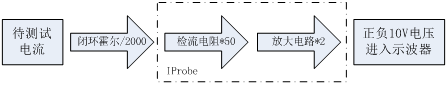

# IProbe 用户手册

## 功能概述

示波器测量电流信号需要使用专用电流探头，能测量直流电流的电流探头基于[霍尔效应]，
价格昂贵，常见的电流探头如TEK A622，量程100A，带宽100k，价格在5k以上，同规格国产
替代型号价格也在2k以上，远超一般爱好者经济负担能力。

IProbe是一款示波器配件，可以与电流霍尔传感器配合使用，为电流霍尔传感器提供电源，
并将电流霍尔传感器输出电流信号转化为可以直接接入示波器的电压信号，方便使用普通
示波器无源电压探头进行电流测量，避免使用昂贵的专用电流探头。

一般闭环电流霍尔传感器都具备至少100k的带宽，通过为IProbe选择不同的量程的霍尔传感器，
可以测量几个安培到几千安培的电流，扩展性良好。通常闭口霍尔传感器具有更好的性能指标。

实物如下图所示：

端口定义如下图：

一般闭环电流霍尔传感器只需要连接：`+ - M` 三个信号，分别对应：`+12V -12V 测量输出`

基本原理见下图：

霍尔传感器将待测试电流缩小2000倍输出，送入IProbe，在IProbe上经过50R测量电阻转化
成电压信号，再将该电压信号放大2倍以后输出，送入示波器测量。

## 示波器设置

假定使用2000:1霍尔，50R测量电阻，IProbe固定2倍增益，那么对应的灵敏度为：
`1A/2000*50*2=0.05A`，即1A电流产生50mV电压输出。灵敏度为：`50mV/A`，
使用示波器**1x电压探头**，测量类型选择电流，通道增益设置20x，即可正常显示电流。

一般示波器通道设置都具备20M带宽限制功能，请打开20M带宽限制，可以滤除无意义的高频
干扰信号。如示波器通道设置具备低通滤波功能，如Micsig TO1152，请打开低通滤波器，
设置截止频率500k，可以更好地滤除高频干扰信号。IProbe带宽不高于100k，500k截止
频率不会影响测量结果。

如示波器通道无20x设置，可将线绕2圈，使用10x设置，绝大多数示波器都有10x探头设置。
使用该方法分辨率加倍，量程减半，也可以缠绕更多圈来测量小电流。

## 推荐霍尔传感器

### [LEM公司](http://www.lem.com/)

全球电量传感器的知名制造者，也是电量传感器领域的领导者。产品价格相对较高，
推荐型号如下，价格在数百元。
- [LT108-S7,100A,2000:1,100k](DOC/LT108-S7.pdf)
- [LT208-S7,200A,2000:1,100k](DOC/LT208-S7.pdf)
- [LT308-S7,300A,2000:1,100k](DOC/LT308-S7.pdf)

### [南京托肯](http://www.token-sensor.com)

国产品牌，产品价格实惠，性价比高，推荐型号如下，价格在数十元。
- [TBC100LP,100A,2000:1,200k](DOC/TBC-LP.pdf)
- [TBC200LP,200A,2000:1,200k](DOC/TBC-LP.pdf)

## 技术指标

| 指标           | 说明        | 备注             |
|:--------------:|:-----------:|:----------------:|
| 测量范围       | 200A        | 取决于霍尔       |
| 带宽           | DC-100k     | 取决于霍尔       |
| 输入测量电阻   | 50R         | 100R 两并        |
| 固定增益       | 2x          |                  |
| 灵敏度         | 50mV/A      | 2000:1, 50R      |
| 工作电源       | 3.7V x 2    | 2节18650         |
| 霍尔供电输出   | +12V -12V   | 实际约12.5V      |
| 体积           | 100x50x24mm | 不含附件         |
| 重量           | 42g         | 不含电池         |

## 购买链接

[IProbe](https://item.taobao.com/item.htm?id=564318225740)

[霍尔效应]: https://en.wikipedia.org/wiki/Hall_effect
